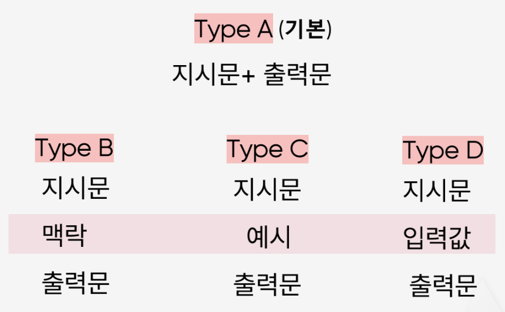

다음은 프롬프트 엔지니어링이 필요한 기능의 목록이다.

- **(기능0)** 사용자의 이력서/포트폴리오 요약
- **(기능1)** 사용자의 요약된 이력서/포트폴리오 분석
- **(기능2)** (Human In The Roop) 사용자의 이력서/포트폴리오 보완
- **(기능3)** (Human In The Roop) 사용자가 제공한 정보 기반의 최종 결과물 산출

## 프롬프트의 요소

: 지시, 입력 데이터, 문맥, 출력 지시문

- 기능0 ~ 기능1에 대해 <mark>type c + type d</mark>를 적용하려고 한다.
	- 기능0 - pdf 값 & 요약 예시 필요
	- 기능1 - 요약 값 & 이력서 분석 템플릿 예시 필요
- 기능2에 대해 <mark>type b + type d</mark>를 적용하려고 한다.
	- 기능 2 - 요약 값 & 사용자와의 대화 맥락 필요
- 기능3에 대해 <mark>type b + type c + type d</mark>를 적용하려고 한다.
	- 기능 3 - 요약 값 & 사용자와의 대화 맥락, 이력서 산출물 예시 필요

## LLM Model

가급적이면 최신 모델을 사용하는 것이 좋지만, 고품질의 프롬프트를 활용하여 <mark>저사양 모델로 고사양 모델의 아웃풋을 뽑아낼 수 있다면</mark> **경제성**의 측면에서 <u>저사양 모델을 사용하는 것이 좋다</u>

### Open AI vs Claude vs Gemini

| 모델                     | 주요 장점                                                                  | 주요 단점                                                    |
| ---------------------- | ---------------------------------------------------------------------- | -------------------------------------------------------- |
| **GPT (OpenAI)**       | - **뛰어난 논리·추론력** - 멀티모달 지원 - **API·시스템 연동 우수** - **활용 범위 넓음** | - 비용 상대적으로 높음 - 설명력·투명성 한계 - 실시간 정보 접근 제한          |
| **Claude (Anthropic)** | - 긴 컨텍스트 처리 - 안전성·윤리성 강조 - 대화 품질 우수                              | - **보수적 답변 경향** - **정보 깊이·창의성 한계** - 최신성·정확도 약간 낮음 |
| **Gemini (Google)**    | - 구글 서비스 연동 강점 - 멀티모달·속도 우수 - 다양한 시나리오 지원                        | - **구글 의존성 높음** - 고급형 비용 부담 - 결과 신뢰도 편차 있음         |

> GPT-4.0을 사용하도록 한다.

- Microsoft Azure Service를 사용하고 있음
- 이력서 Assistant 서비스에는 OpenAI의 모델이 적합하다는 결론! (위의 표 참고, 추후 보완 예정)

## Language

### English vs Korean

> 영어를 사용하려고 한다.

1) **모덱 최적화 & 일관성**
2) **정확성 & 고도화**
3) **문서화 & 레퍼런스 활용**

* 최종 사용자 입력/출력은 한국어로 설정할 것임.
* 프롬프트 프레임워크는 영어로 설계하고, 사용자 입력 및 출력 응답을 한국어로 작성하도록 LLM에 명확히 지시하는 방식이 현업에서 표준임.
