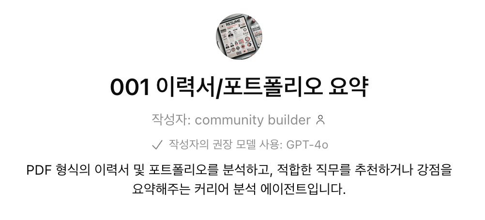

# 사용자의 이력서/포트폴리오 요약


> 사용자가 PDF 형식의 이력서/포트폴리오를 업로드하면, RAG 기반으로 요약해주는 기능

- 요약을 하는 이유는?
	- 비용 및 시간 절약을 위해서
	- 모든 포트폴리오/이력서 PDF를 매 질문을 던질 때마다 확인할 수 없기 때문

- 프롬프트 기획이 필요한 이유?
	- 관찰1: 프롬프트가 짧고 일반적이다.
	- 관찰2: 포맷이 없어 정보 누락 다수
	- 해결: **구조화된 템플릿**을 활용한 요약 문서 자동 생성

**코드**:
```python
chain = load_qa_chain(llm, chain_type="stuff")
docs = db.similarity_search("이 이력서를 간단히 요약해주세요.", k=5)
summary = chain.run(input_documents=docs, questions="이 이력서를 요약해주세요.")
reutnr summary.strip()
```

## Before

**Prompt**

```
이 이력서를 간단히 요약해주세요. (벡터DB-임베딩 모델 사용에 검색용 쿼리)
```

```
이 이력서를 요약해주세요. (LLM generation을 위한 요약용 질문 프롬프트)
```

**Output**

```
### 🧑‍💻 **개인 정보**

- **이름:** 이시윤
    
- **이메일:** siyunkr@gmail.com
    
- **전화번호:** 010-8929-3717
    
- **Github:** [github.com/cyunlee](https://github.com/cyunlee)
    
- **생년월일:** 1999.03.01
    
- **주소:** 서울특별시 마포구 마포대로 라길 4 30
    

---

### 🎓 **학력**

- **학교:** 서울여자대학교 (2019.03 ~ 2024.02)
    
- **전공:** 정보보호학과 (GPA: 3.29/4.5)
    

---

### 💼 **경력**

- 없음
    

---

### 📚 **교육 과정**

1. **포스코 (2023.10 ~ 2024.04)**  
    웹 프론트엔드 및 백엔드 기초 (React.js, Node.js, Spring 등) 및 팀 프로젝트 수행
    
2. **패스트캠퍼스 (2025.02 ~ 2025.04)**  
    Springboot, JPA 중심의 백엔드 심화 과정 및 팀 프로젝트
    
3. **Microsoft (2025.05 ~ 2025.08)**  
    Azure 기반 AI, 클라우드 컴퓨팅, 머신러닝, 딥러닝 학습 및 팀 프로젝트
    

---

### 🛠 **기술 역량**

- **Frontend:** React.js, JavaScript (ES6+), Redux, Context API
    
- **Backend:** Java, Spring Boot, JPA, Node.js, Express, JWT
    
- **Database:** MySQL
    
- **기타:** C++, Python (스크립트 자동화/알고리즘), Figma (UI/UX 디자인)
    

---

### 🏅 **자격증**

- TOEIC 905점 (2022, YBM)
    
- 정보처리기사 (2024.09.10, 한국산업인력공단)
    
- SQLD (2024.09.20, 한국데이터산업진흥원)
    

---

### 👥 **대외활동 및 스터디**

- **스터디CS (2024.12 ~ 2025.03):** 운영체제, 네트워크, 데이터베이스 등 발표 및 학습
    
- **Effective Java (2025.01 ~ 2025.03):** 자바 개념 심화 학습
    

---

### 🗣 **자기소개서 핵심 요약**

- 졸업 프로젝트를 통해 개발에 흥미를 느끼고 실무 중심의 역량을 키워온 풀스택 개발자 지망생
    
- 프론트엔드 중심으로 시작해 백엔드까지 도전하며 React, Spring Boot, Node.js, JWT 등 다양한 기술 경험
    
- 문제 해결 중심의 학습 방식과 실행력 강점, 팀워크와 커뮤니케이션 능력 강조
    
- AI 관련 기술도 학습 중이며 장기적으로 사용자 중심의 가치를 구현하는 개발자를 목표로 함
```
## After

- 영어 사용
- 역할 부여
- 예시 포맷 첨부
- markdown list, emphasis 사용
- xml tag 사용

### 1️⃣ 벡터DB 검색용 쿼리

1) 한국어
```
이력서 요약에 필요한 핵심 내용을 찾아줘.
```

2) English
```
Find the most relevant information for summarizing the resume. 
```

### 2️⃣ LLM 요약 생성용 쿼리



Q. 프로필 사진을 포함하는 게 좋을 것 같은데 논의가 필요하다.

> 아웃풋 포맷은 링크드인의 항목을 참고하였음

**Prompt**
1) 한국어
```
당신은 취업 및 이직 준비생을 위한 직업 컨설턴트입니다.

>> 사용자의 이력서/포트폴리오를 요약해주세요.

분량: A4 1장

- Output Format:
1. 헤드라인
	- 자신의 직업, 전문분야, 주요 역량 등을 120자 이내로 요약하는 한 줄 소개.
	- 예시) 마케팅 전문가 | 데이터 분석 | 디지털 전략
2. 소개글
	- 본인의 경력, 강점, 목표, 가치관을 500자 이내의 스토리텔링 형식 또는 요약식으로 작성
3. 경력, 교육사항, 대외활동
	- 회사명, 직책, 근무기간, 주요 역할과 책임, 구체적 성과(숫자, 수치 중심)
	- 교육기관명, 교육기간, 주요 내용
	- 대외활동명, 활동기간, 주요 내용
4. 학력
	- 학교명, 전공, 학위, 재학 및 졸업 연도
5. 기술
	- 직무 연관성 높은 스킬 5~10개 가량 등록
	- 예시) Java, 분석, PM 등
6. 자격증, 수료증
	- 자격증명, 발급기관, 취득연도
7. 프로젝트
	- 주요 프로젝트명, 역할, 성과
```

2) English
```

```

**Output**
1) 한국어
```
**1. 헤드라인**  
풀스택 개발자 | React, SpringBoot 기반 웹 개발 | 문제 해결 및 협업 중심

**2. 소개글**  
정보보호학을 전공하며 기술적 기초를 다진 후, 졸업 프로젝트를 계기로 개발의 매력을 발견하였습니다. 포스코, 패스트캠퍼스, Microsoft 등에서 다양한 웹/AI 관련 교육을 수료하며 프론트엔드부터 백엔드, 클라우드까지 실무 프로젝트 경험을 쌓았습니다. 실행력이 강한 성향으로 여러 스터디를 주도하며 학습을 구조화하고, 빠르게 변화하는 기술 환경에서도 능동적으로 대처해왔습니다. 앞으로는 단순 기능 구현을 넘어 사용자의 문제를 해결하고, AI 기술을 기반으로 가치 있는 서비스를 개발하는 문제 해결형 개발자를 목표로 합니다.

**3. 경력, 교육사항, 대외활동**

- **경력**: 없음
    
- **교육사항**:
    
    - 포스코 (2023.10–2024.04): React, Node.js, Spring 기반 웹개발 부트캠프
        
    - 패스트캠퍼스 (2025.02–2025.04): Springboot, JPA 중심 백엔드 심화과정
        
    - Microsoft (2025.05–2025.08): Azure 기반 AI, ML, DL 프로젝트
        
- **대외활동**:
    
    - CS 스터디 (2024.12–2025.03): 컴퓨터 구조, OS, 네트워크, DB 학습 및 발표
        
    - Effective Java 스터디 (2025.01–2025.03): 자바 개념 심화 학습 및 발표
        

**4. 학력**

- 서울여자대학교 정보보호학과 (2019.03–2024.02, GPA 3.29/4.5)
    

**5. 기술**

- 프론트엔드: React.js, JavaScript (ES6+), Redux, Context API
    
- 백엔드: Java, Spring Boot, JPA, Node.js, Express, JWT
    
- 기타: MySQL, C++, Python, Figma (UI/UX), Git
    

**6. 자격증, 수료증**

- TOEIC 905 (2022, YBM)
    
- 정보처리기사 (2024.09.10, 한국산업인력공단)
    
- SQLD (2024.09.20, 한국데이터산업진흥원)
    

**7. 프로젝트**

- 졸업 프로젝트: 시각장애인 길 안내 앱 (Android Studio 기반)
    
- 포스코 부트캠프: 팀 기반 웹 개발 프로젝트
    
- 심리상담 웹사이트: React + TypeScript + Node.js + JWT 기반 풀스택 개발
    
- Microsoft Azure 프로젝트: 클라우드/AI 기반 팀 프로젝트
```

2) English

<hr>

# 성능 평가

### 